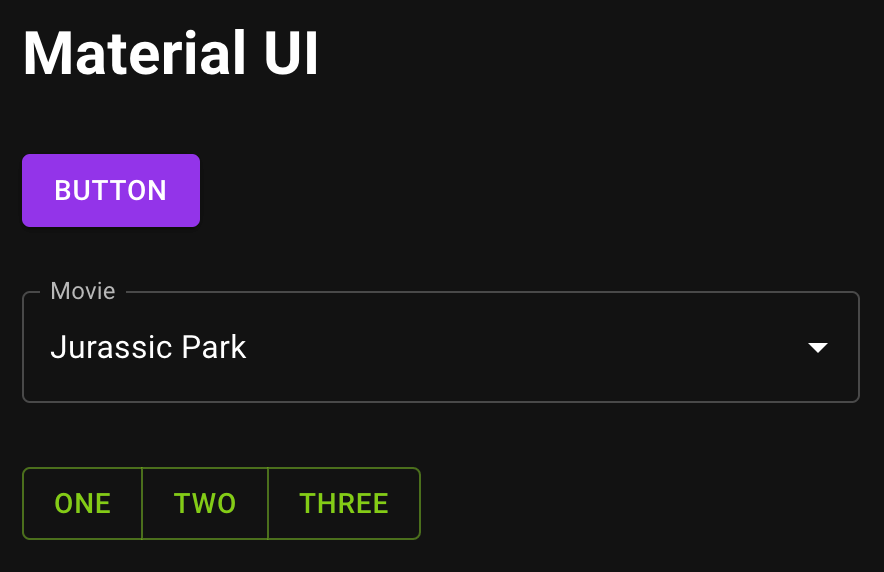

# Material UI

## Description

This is a simple project to test the React Material UI library.

> Note: The project is built with Vite and uses TypeScript
> Note: This is a work in progress. Expect more features to be added soon

#### Screenshot

## Installation

- Clone the repository
- Run `npm install` to install the dependencies
- Run `npm run dev` to start the development server
- Open your browser and navigate to `http://localhost:5173/`

## Resources

- [Material UI](https://material-ui.com/)
- [Vite](https://vitejs.dev/)
- [TypeScript](https://www.typescriptlang.org/)
- [React](https://reactjs.org/)

## License

- [MIT](LICENSE.md)

&nbsp;

&nbsp;

[**Go To Top &nbsp; ⬆️**](#material-ui)
